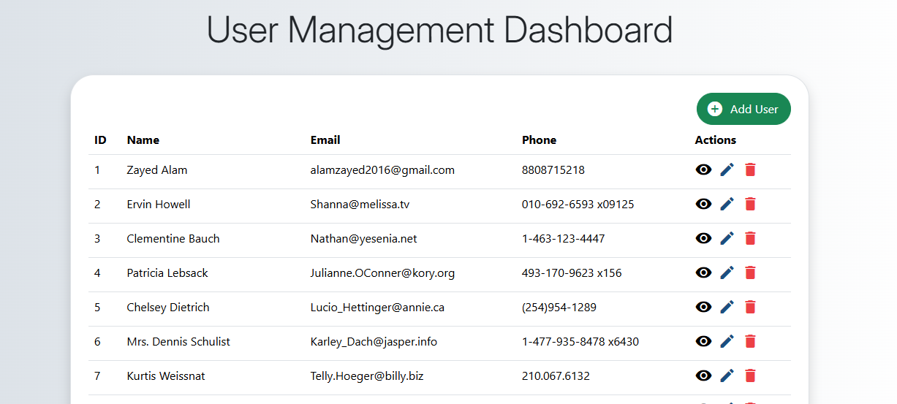

# **User Management App**

## **Overview**
This is a full-stack **CRUD application** built with **React** using **Vite** as the build tool. The app performs Create, Read, Update, and Delete operations on user data stored in a **JSON Server** database. 


## **Screenshots**




### **Features**
- **AddUser**: Form to add new users to the database.
- **EditUser**: Form to update user details.
- **Home**: Display list of all users with options to view, edit, or delete.
- **ReadUser**: Display detailed user information.
- **Design**: Built with **Bootstrap** and **Material UI Icons** for modern UI.

## **Technologies Used**
- **React**: Frontend library to build the user interface.
- **Vite**: Fast build tool for development and production.
- **Axios**: For making API calls to interact with the JSON Server.
- **JSON Server**: Simulates a real REST API with a mock database.
- **React Router DOM**: To manage different pages for the CRUD operations.
- **Bootstrap**: For responsive and user-friendly design.
- **Material UI Icons**: For icons used throughout the app.

## **Project Setup**

### **1. Clone the Repository**
```bash
git clone <repository-url>
cd <project-directory>
```

### **2. Install Dependencies**
Install the required packages using npm or yarn:
```bash
npm install
```

### **3. Start the Application**
To start the React application with Vite:
```bash
npm run dev
```

### **4. Start the JSON Server**
In a separate terminal window, run the JSON Server:
```bash
npx json-server --watch db.json --port 5000
```

## **Project Structure**
```
/src
  /pages
    AddUser.js       # Add new user form
    EditUser.js      # Edit user form
    Home.js          # List of all users
    ReadUser.js      # View detailed user info

  App.js             # Main app component
  db.json            # Mock database for JSON Server
```

## **CRUD Operations**
1. **Create**: Add new users via the AddUser form, which sends a POST request to the API.
2. **Read**: View a list of users on the Home page, with the option to view more details or edit.
3. **Update**: Edit existing user information via the EditUser form (accessible from the Home page).
4. **Delete**: Delete users directly from the Home page using a DELETE request.


## **Conclusion**
This app demonstrates a simple yet powerful full-stack CRUD application using modern tools like React, Vite, Axios, and JSON Server, with an intuitive UI built using Bootstrap and Material UI Icons.

